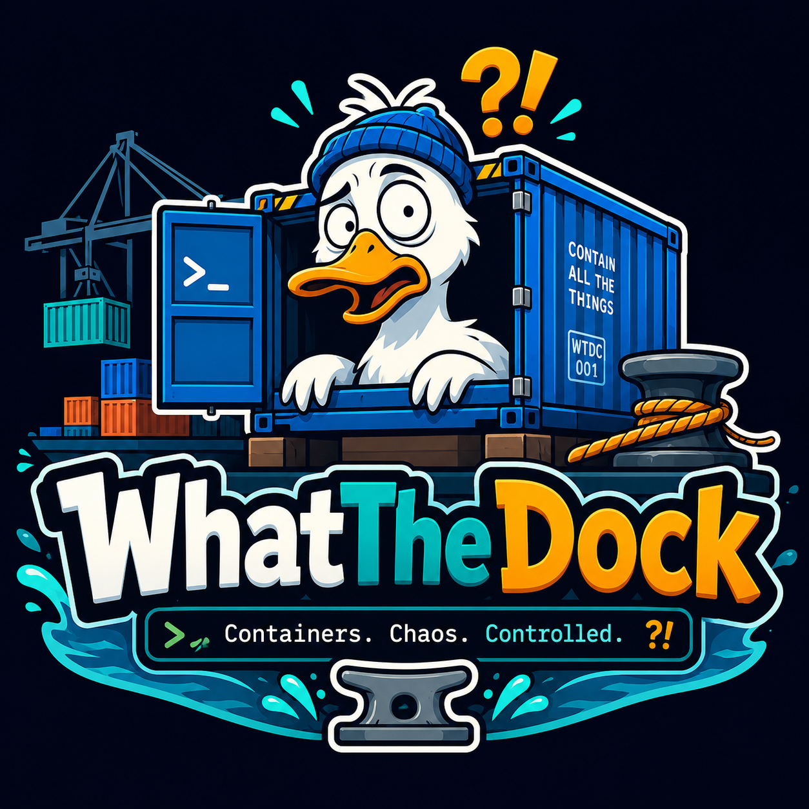
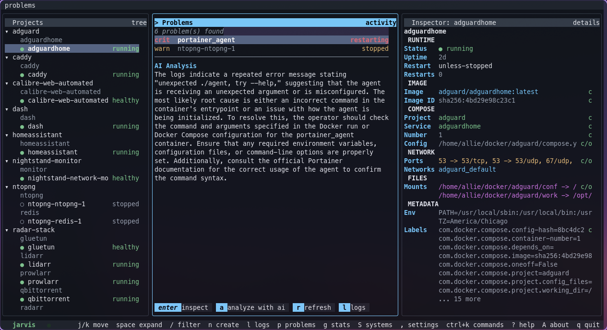
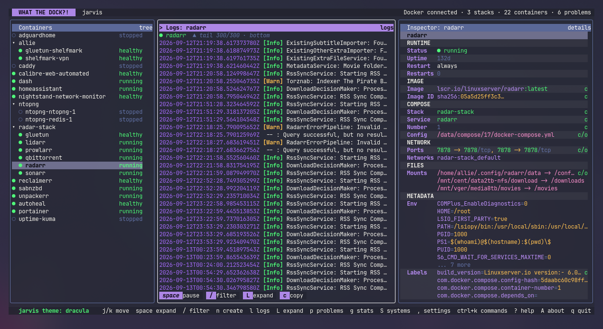
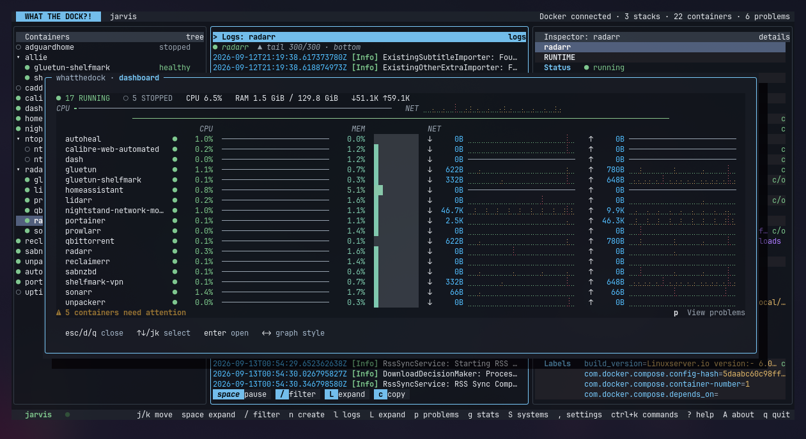
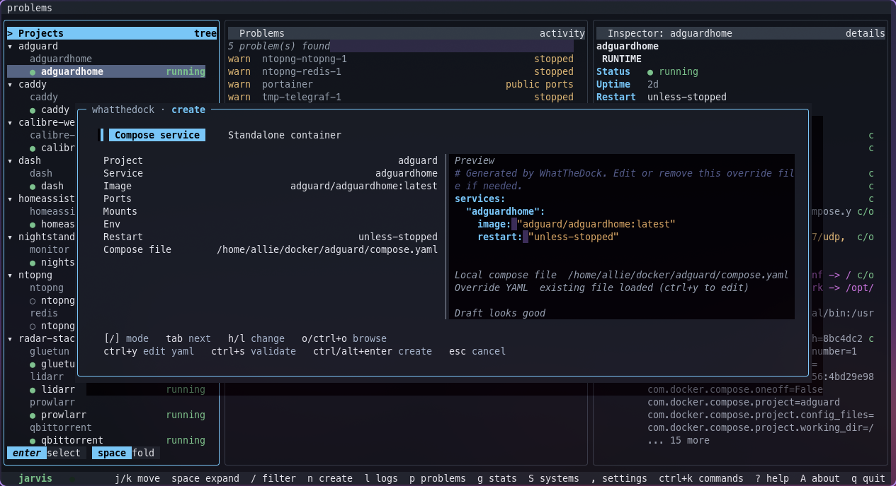

# WhatTheDock



**A keyboard-first Docker and Compose manager for the terminal.**

WhatTheDock is a new member of the Tide application family, alongside Tide and
TideMail. It uses [TideUI](https://github.com/allisonhere/tideui) for the shared
three-pane terminal shell, themes, pane chrome, row styling, overlays, and other
presentation primitives.

> Early-stage project: this repository currently contains the first working
> vertical slice, not the full planned Docker operations suite.

## Screenshots

<table>
<tr>
<td width="50%">

**Problems, with AI analysis**


</td>
<td width="50%">

**Logs**


</td>
</tr>
<tr>
<td width="50%">

**Dashboard: fleet summary and every container's CPU/memory/network**


</td>
<td width="50%">

**Create / edit**


</td>
</tr>
</table>

## Philosophy

WhatTheDock treats Compose stacks as first-class objects. The default view keeps
single-container Compose apps looking like containers and groups multi-container
Compose apps into collapsible stacks.

The app should work with zero WhatTheDock-specific configuration. Running
`whatthedock` honors Docker's normal environment and context defaults and connects
to the local daemon when Docker is available.

User preferences are stored as JSON in the platform config directory, normally
`~/.config/whatthedock/settings.json` on Linux. Missing or invalid settings fall
back to built-in defaults.

## Systems

Press `S` to manage Docker systems from inside the app. The Systems overlay can
switch between named systems, test a system connection, add new systems, edit
existing systems, and delete inactive systems.

Supported system types:

- `local`: uses Docker's normal defaults, or an optional explicit Docker host.
- `ssh`: opens an SSH socket tunnel from a local unix socket to a remote Docker
  socket.

SSH systems have separate `Host`, `User`, and optional `Port` fields. Existing
settings that used `user@host` in the host field are still accepted and are
shown as separate user and host values in the app.

SSH systems support three auth modes (`Auth` cycles between them):

- `config/agent`: uses your existing SSH config, keys, and agent in the
  background — fully automatic, including on app launch.
- `keychain`: stores the password in your OS keychain (Secret Service on
  Linux, Keychain on macOS, Credential Manager on Windows) via a native Go
  SSH client, so this also connects automatically, including on app launch —
  the password never touches settings.json, a subprocess's argv, or its
  environment. Host keys are checked against your real `~/.ssh/known_hosts`,
  same as a normal `ssh` connection; deleting a keychain-mode system also
  removes its stored password.
- `password prompt`: temporarily hands the terminal to `ssh` while switching
  systems so OpenSSH can ask for the password, then returns to WhatTheDock —
  the password is typed fresh every time and never stored anywhere.

Only `keychain` mode stores anything: `config/agent` and `password prompt`
never persist a password or key anywhere WhatTheDock controls. An automatic
connection attempt (app launch, or any other non-interactive path) that
would otherwise need to prompt now fails fast instead of hanging, and a
configured active system that can't connect no longer blocks the app from
launching — it falls back to local Docker and says why.

Settings and Systems form changes are saved with `Ctrl+S`; `Esc` cancels
unsaved form edits. Systems editor text fields support normal caret editing
with `Left`/`Right`, `Backspace`, `Delete`, `Home`, `End`, and `Ctrl+U` to clear
the active field. Choice fields such as `Kind` and `Auth` cycle with
`Left`/`Right`, `h`/`l`, or `Enter`. SSH systems are validated before save,
switch, or test: `Host` is required, `Port` must be numeric when set, and both
Docker socket paths must be present.

## Current Controls

| Key | Action |
|---|---|
| `j` / `Down` | Move down |
| `k` / `Up` | Move up |
| `Enter` | Select/open, or expand/collapse Compose stack |
| `Space` | Expand/collapse Compose stack |
| `/` | Filter stacks and containers |
| `n` | Create container or Compose service draft |
| `s` | Start/stop selected container |
| `r` | Refresh Docker state |
| `Alt+r` | Restart selected container |
| `u` | Replicate: pull the latest image and recreate in place |
| `D` | Delete: stop and remove the container, and delete its definition (`docker rm` for a standalone container; for a Compose service, its override and/or its block in the base compose file). On a stack row, deletes the whole stack: stops and removes every container it defines and deletes its compose file; on a container that's part of a multi-service stack, prompts to delete just that service or the whole stack |
| `C` | Clone under a new name via the create overlay |
| `m` | Edit in place: prefill the create overlay from the selection under its own identity, replacing it on confirm. Single-service create/edit forms include an Image action choice to keep the current image or pull latest before applying. On a stack row, edits the whole stack's base compose file directly; on a container that's part of a multi-service stack, prompts to edit just that service or the whole stack |
| `Ctrl+K` -> `Curate Docker images` | Review images on the active Docker system, select unused or dangling images, and confirm cleanup. In-use images are shown but cannot be selected. |
| `Ctrl+K` -> `Curate Compose files` | Save running Compose stack files into the local WhatTheDock catalog, edit library YAML/notes/tags, filter by state, save draft copies, or Make Live on a local/SSH system. |
| `e` | Open a shell inside the selected running container |
| `c` | Copy selected container details |
| `o` | Open selected container ports, mounts, or Compose paths |
| `l` | Focus logs |
| `L` in logs | Expand logs: shrink the tree/inspector panes to icon-only slivers and let logs fill nearly the whole width; press again to restore |
| `p` | Show problems |
| `a` in problems | Analyze the selected problem with AI |
| `g` | Show stats graphs |
| `/` in logs | Open the live log filter — hides non-matching lines and highlights matches as you type, no Enter needed |
| `e` / `w` / `i` / `a` in logs | Show errors, warnings, info, or all log lines |
| `j` / `k` in logs | Scroll log history |
| `PgUp` / `PgDown` in logs | Page through log history |
| `Home` / `End` in logs | Jump to log start or resume tail |
| `Space` in logs | Toggle live/paused log tail |
| `f` in logs | Resume live log tail |
| `Esc` in logs | Clear the active log filter (also stops editing it, if open) |
| `T` | Theme picker |
| `S` | Manage local and remote Docker systems |
| `,` / `Ctrl+,` | Settings |
| `Ctrl+S` in settings/forms | Save changes |
| `[` / `]` in create form | Switch between Compose service and standalone container |
| `o` / `Ctrl+O` in Compose create form | Browse for a Compose file, locally or on the active SSH system |
| `Ctrl+P` in Compose create form | Open the saved Compose catalog |
| `Ctrl+Y` in Compose create form | Hand-edit the override YAML in a full-size editor |
| `Ctrl+Enter` / `Alt+Enter` in create form | Review the confirmation step |
| `y` / `n` in create confirmation | Confirm or cancel |
| `Ctrl+K` | Command palette |
| `?` | Keyboard help |
| `A` | About screen with Spotlights-style ANSI splash animation |
| `d` | Full-screen fleet dashboard: host summary plus every running container's CPU/memory/network, with row selection |
| `j` / `k` / click in dashboard | Select a container row; `Enter` or click opens it in the Inspector |
| `q` | Quit |

Mouse row selection and wheel navigation are enabled where the terminal and
Bubble Tea support them.

## Compose catalog

The Compose curator preserves actual Compose files referenced by running
containers' Docker Compose labels. Running stacks are treated as live sources:
`Enter`/`e` saves them to the local library if needed, then opens the catalog
copy in a Ripple-backed YAML editor. Live files are not changed until a
catalog entry is made live.

For multi-file stacks, every referenced file is stored together in one local
WhatTheDock catalog entry. Notes are kept in catalog metadata and mirrored
into a WhatTheDock-managed comment block at the top of the primary Compose
file. Catalog entries can be tagged, filtered by draft/saved/applied/active/
unused/archived state, previewed with `Enter`, edited with `e`, added from a
URL/path with `A`, added from the file browser with `B`, started as a blank
draft with `N`, duplicated as drafts with `S`, loaded into Create with `c`,
archived, deleted, or made live with `M`. Make Live asks for a destination
path, shows any existing files it would overwrite, and then writes the files
to the active local or SSH system before running `docker compose up -d`.

## Install

Install the latest published release for your platform (Linux/macOS,
amd64/arm64):

```bash
curl -fsSL https://raw.githubusercontent.com/allisonhere/whatthedock/main/scripts/install.sh | sh
```

Downloads the binary attached to the latest GitHub release, verifies it runs,
and installs it to `/usr/local/bin` (or `~/.local/bin` if that isn't
writable — set `INSTALL_DIR` to override either). Only a platform actually
published for the latest release will succeed; see [Release](#release)
below for how releases get published.

## Build

Install the latest `main` build with Go:

```bash
go install github.com/allisonhere/whatthedock/cmd/whatthedock@latest
```

```bash
go mod download
go build ./...
```

Run locally:

```bash
go run -buildvcs=false ./cmd/whatthedock
```

Run without Docker using the built-in demo homelab:

```bash
go run -buildvcs=false ./cmd/whatthedock --demo
```

You can also use:

```bash
WHATTHEDOCK_PROVIDER=demo go run -buildvcs=false ./cmd/whatthedock
```

Or build a binary:

```bash
go build -buildvcs=false -o whatthedock ./cmd/whatthedock
./whatthedock
```

Print the build version:

```bash
whatthedock --version
```

Release builds can stamp version metadata with Go linker flags:

```bash
go build -buildvcs=false \
  -ldflags "-X main.version=v0.1.0 -X main.commit=$(git rev-parse --short HEAD) -X main.date=$(date -u +%Y-%m-%d)" \
  -o whatthedock ./cmd/whatthedock
```

## Release

Publishing a release (build, sign, tag, push the tag, and create the
GitHub release with the binary and its signature attached) is a small
TUI, not a manual sequence of commands:

```bash
go run ./cmd/release
```

Shows the branch, latest tag, and commit log/diff stat since that tag, lets
you confirm or edit the suggested next version, then runs every step with
live progress. Add `-dry-run` to walk through the whole flow (including a
real build and a real signature) without actually tagging, pushing, or
publishing anything.

Every release binary is signed with a detached ed25519 signature (see
"Update security" below) — `go run ./cmd/release -genkey` generates the
one-time signing keypair; the private half is exported as
`WHATTHEDOCK_SIGNING_KEY` and must never be committed, and the public half
is baked into `internal/update`. A release without `WHATTHEDOCK_SIGNING_KEY`
set fails at the Sign step rather than publishing unsigned.

### Update security

The self-updater doesn't trust "GitHub served it over HTTPS" alone: every
release's binary is signed at publish time (see above), and
`internal/update.ReplaceRunningExecutable` verifies that signature against
a public key baked into the already-installed binary before it will
overwrite anything — an unsigned or invalid update is refused outright,
never installed. The signing private key only ever exists on the
maintainer's own machine.

## Development

```bash
make fmt
make test
make vet
make build
```

More detail:

- [Container and Compose creation workflow](docs/creation.md)
- [Engineering handoff](docs/handoff.md)

## Current Features

- Connects through the official Docker Go client using Docker defaults.
- Discovers Compose stacks from standard Compose labels.
- Shows single-container Compose apps and standalone containers as container rows.
- Supports stack collapse/expand and fast substring filtering.
- Displays useful selected-container details without dumping Docker JSON.
- Streams selected-container logs through a cancellable reader with color-coded
  timestamps, severity, HTTP methods, and HTTP status codes.
- Supports a live log filter (hides non-matching lines and highlights matches
  character-by-character as you type, no Enter needed), severity quick
  filters, scrollback, follow-tail pause/resume (`Space`), an expanded
  view (`L`) that shrinks the tree/inspector panes to icon-only slivers so
  logs get nearly the full terminal width, and per-container log view
  state.
- Shows a problems view for unhealthy, restarting, stopped, dead, high-restart,
  unknown-health, and public-port containers, split into the problem list plus
  a lower panel with a rule-based, zero-network suggestion for whichever
  problem is selected — synthesized from that container's own state (health,
  restart count, exit status, restart policy), updating instantly as the
  selection moves. Press `a` to go further: an opt-in "analyze with AI" call
  that sends the container's state, that same rule-based read, and its recent
  log tail to a configured AI provider (Anthropic, OpenAI, Gemini, or any
  OpenAI-compatible custom endpoint, e.g. a local Ollama server) for a deeper,
  colored explanation — never fired automatically, and never sent anywhere
  without a provider configured in Settings. The finished analysis is also
  copyable through the Copy overlay (`c`) once you've selected that container.
- Shows polling stats graphs and sparklines for the selected container, with
  CPU, memory, network, disk I/O, restart, uptime, and PID readouts.
- Press `d` for a full-screen fleet Dashboard, or turn on Settings → Behavior
  → "Start in dashboard" to open straight into it on launch instead. A
  compact header line separates fleet status counts (running/stopped/
  restarting/dead/unhealthy, colored the same as everywhere else in the app)
  from aggregate CPU/RAM and network throughput; CPU and RAM only pick up a
  warning or critical color once they actually cross a threshold, instead of
  looking alarming at any level of ordinary activity. Each running container
  gets a row with a CPU trend sparkline and a memory meter, both colored the
  same absolute-threshold way — a container quietly sitting at 0.4% memory
  never renders the same as one actually near its limit — plus a network
  trend for both directions (`↓`/`↑`) on wide terminals, collapsing
  gracefully to bare numbers on narrow ones without corrupting the layout.
  Rows are keyboard- (`j`/`k`/arrows) and mouse-navigable; selecting one and
  pressing `Enter` (or clicking it) opens that container in the Inspector,
  reusing the same selection path the tree uses. A dedicated bottom row
  surfaces stopped/dead/unhealthy counts with a clickable "View problems"
  (`p`) action only when something actually needs attention, and stays quiet
  otherwise. Honors the same Graph style and refresh interval configured in
  Settings, and polls independently of whichever container is selected
  elsewhere.
- Includes a grouped settings panel with reset defaults, persisted graph style,
  graph colors, log color mode, log health color, deltas, refresh interval,
  default activity pane, whether to start in the fleet Dashboard, a modal
  drop shadow toggle, a "Check for update" action, an AI provider/model/API
  key/base URL section for the Problems pane's "analyze with AI" action (the
  provider's own standard environment variable — `ANTHROPIC_API_KEY`,
  `OPENAI_API_KEY`, `GEMINI_API_KEY` — always takes precedence over a stored
  key, so exporting one works with no Settings change at all), and a
  Diagnostics section with an app-activity log (off/on/save-to-disk) and a
  viewer for it. Settings are written with owner-only (`0600`) file
  permissions, since the AI API key is the first secret WhatTheDock persists.
- Checks GitHub for a newer release on every launch ("Check for update" in
  Settings also triggers the same check on demand, and always surfaces the
  install prompt directly — even from inside Settings — rather than a
  status-bar hint). A newer version prompts "update now (`y`) or ignore
  (`n`/`Esc`)"; ignoring is remembered per-version, so it won't ask again
  about that release, but a later one prompts fresh (a manual check always
  re-shows it, even for a version already ignored). Confirming stays on the
  same popup with a fill-bar showing install progress, downloads the
  matching release asset, verifies its signature (see "Update security"
  below — a failed check refuses to install rather than overwriting
  anything), and atomically replaces the running binary; the popup then
  shows an "updated to vX.Y.Z" confirmation and waits for enter
  before restarting into it — same terminal, no manual restart, and no
  guessing how long the message needs to stay up.
- Starts, stops, restarts, and refreshes containers.
- Drafts new Compose services or standalone containers in a keyboard-first
  creation overlay with live generated previews, syntax-highlighted YAML, and
  inline validation as you type. Standalone drafts can be created and started
  after an explicit confirmation. For a Compose service the base compose file
  already defines, confirming merges the draft's fields directly into that
  service's existing block in the base file — comment- and formatting-
  preserving, touching only the fields that changed — instead of layering a
  separate override on top, and drops any override left over from before the
  service existed in base. For a brand-new service the base file doesn't
  define yet, WhatTheDock still writes a `compose.whatthedock.<service>.yml`
  override beside the selected Compose file, validating a temporary copy with
  `docker compose config` first. Either way, `docker compose up -d <service>`
  runs after confirmation. This works against both local systems and SSH
  systems, running every step — reading/writing the compose file, and the
  `docker compose` calls — on the remote host. Editing an already-managed
  service detects and loads its existing override (if any), otherwise it reads
  the base compose file itself, and the form's fields update to match whatever
  Compose content is actually loaded or hand-edited. The Compose
  file field includes a file browser (local or remote) for finding
  `compose*.yml`, `compose*.yaml`, `docker-compose*.yml`, and
  `docker-compose*.yaml` files. Press `Ctrl+P` to open the local Compose
  catalog: save the current draft as a reusable YAML template, filter/load
  saved templates into this create/edit flow, and rename or delete catalog
  entries without touching any deployed stack. Press `Ctrl+Y` to hand-edit
  the generated override directly in a full-size
  [Ripple](https://github.com/allisonhere/ripple)
  editor, with real-time lint feedback and an optional persistent vim mode
  (Settings → Editor). An already-labeled container whose Compose file
  doesn't actually exist on disk — the signature of a stack deployed by a
  tool (Portainer is the common case) that manages its own copy of the
  compose file elsewhere rather than leaving one at the path it stamps into
  the container's labels — gets a distinct confirm step instead of a bare
  failure: confirming writes a brand-new compose file there with the
  service's current definition and adopts it out of that tool's management,
  going forward a normal Compose service WhatTheDock (and `docker compose`
  directly) controls.
- Pasting or loading a compose file that defines more than one service is
  detected automatically — no separate mode to pick. The form relabels
  itself "Compose stack (N)", the single-service fields (Image, Ports, ...)
  give way to just Stack and the compose file path, and confirming writes
  the whole document as the base compose file and brings every service in
  it up with a single `docker compose up -d` (no service filter), instead
  of only starting whichever one service the draft happened to target.
  Trimming the content back down to one service reverts to the ordinary
  single-service form automatically. Editing an existing multi-service
  stack works the same way: select its stack row and press `m`
  to edit the whole stack's base file directly, or press `m` on one of its
  individual containers to get a prompt choosing between editing just that
  service or the whole stack.
- Deletes (`D`), replicates (`u`), clones (`C`), and edits (`m`) the selected
  container or Compose service. Delete is a real, permanent removal for both
  kinds: it stops and removes the container, then deletes the service's
  definition everywhere WhatTheDock knows about it — the generated override,
  if any, and its block in the base compose file if the base file defines it
  (comment-preserving) — or a real `docker rm -f` for a standalone container.
  Deleting a whole stack works the same way one level up: select the
  stack row and press `D` for an itemized confirm naming every
  service that will stop, then `docker compose down` (containers and
  networks; named volumes are left alone) followed by deleting the base
  compose file itself and any now-orphaned per-service override files.
  Pressing `D` on one of that stack's individual containers instead
  prompts to choose between deleting just that service or the whole
  stack.
  Replicate
  pulls a fresh copy of the image and recreates the same container/service in
  place under its existing identity. Clone opens the create overlay prefilled
  with the original's full ports/mounts/env/restart/command under a new,
  `-clone`-suffixed name, producing an independent second container/service.
  Edit opens the same overlay prefilled the same way but under the
  container/service's own identity, so confirming replaces it in place
  instead of creating something new. Single-service Create/Edit forms also
  show `Image action`: `keep` leaves the image cache alone, while `pull
  latest` runs `docker compose pull <service>` before `up -d` for Compose
  services, or pulls the standalone image before create/recreate. If a
  standalone edit pull fails, the existing container is left running. After
  confirmation, Create/Edit progress appears in the confirmation overlay as a
  smooth 0–100% bar that takes about three seconds even when the real action
  finishes faster; Delete/Replicate still use the status bar. Standalone
  Docker API pulls show real per-layer pull progress, while Compose operations
  show phase labels because they shell out to `docker compose`.
- Curates Docker images from the command palette. The inventory is scoped to
  the active system and shows tags, short IDs, sizes, usage counts, and
  dangling status. Select removable images with `Space`, press `d`, then use
  `y` or `Enter` to continue; removed images disappear from the same modal
  list, while image removal is never forced and individual failures remain
  visible.
- Opens an interactive shell inside the selected running container (`e`),
  handing the real terminal to `docker exec -it` (preferring `bash`, falling
  back to `sh`) and resuming WhatTheDock when the session ends. Works against
  SSH systems the same way, over the already-established socket tunnel.
- Copies selected container IDs, images, Compose metadata, ports, mounts, and
  labels via terminal OSC52 clipboard escape sequences.
- Opens published ports, bind mounts, and Compose config paths from the
  inspector.
- Shows actionable Docker connection and permission errors.
- Includes a built-in demo provider for development on machines without Docker.

## Relationship To TideUI

WhatTheDock depends on TideUI for reusable Tide-family TUI presentation:

- three-column layout
- themed panes and borders
- rows and muted/selected states
- status bar
- modal overlays
- terminal theme primitives

Application state, Docker access, filtering, actions, and log lifecycles stay in
WhatTheDock.

## Planned Features

- Docker event stream.
- Open/copy actions for environment values.
- Deeper problem detection for orphaned, stale, and resource-heavy Docker
  resources.
- Multi-host support for local sockets, Docker contexts, and SSH-backed
  contexts.
- Image update availability checks based on registry metadata rather than
  fragile tag assumptions.
